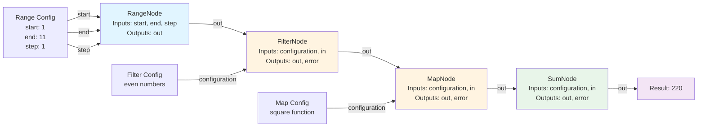

# StreamWeave

[](https://crates.io/crates/streamweave)
[](https://docs.rs/streamweave)
[](https://github.com/Industrial/streamweave/actions)
[](https://codecov.io/gh/Industrial/streamweave)
[](https://creativecommons.org/licenses/by-sa/4.0/)

**Composable, async, stream-first computation in pure Rust**  
*Build fully composable, async data pipelines using a fluent API.*

StreamWeave is a general-purpose Rust framework built around the concept of
**streaming data**, with a focus on simplicity, composability, and performance.

**High-Performance Memory Management:** Achieves optimal performance through advanced memory pooling techniques, including buffer pooling and string interning, significantly reducing allocation overhead and improving cache locality. This results in ultra-low latency and maximum throughput.

## ✨ Key Features

- Pure Rust API with zero-cost abstractions
- Full async/await compatibility via `futures::Stream`
- Fluent pipeline-style API with type-safe builder pattern
- **Graph-based API** for complex topologies with fan-in/fan-out patterns
- **Flow-Based Programming (FBP)** patterns with type-safe routing
- Comprehensive error handling system with multiple strategies
- Code-as-configuration — no external DSLs
- Extensive package ecosystem for I/O, transformations, and integrations

## 📦 Core Concepts

StreamWeave breaks computation into **three primary building blocks**:

| Component       | Description                                |
| --------------- | ------------------------------------------ |
| **Producer**    | Starts a stream of data                    |
| **Transformer** | Transforms stream items (e.g., map/filter) |
| **Consumer**    | Consumes the stream, e.g. writing, logging |

All components can be chained together fluently. These components can be used in both the **Pipeline API** (for simple linear flows) and the **Graph API** (for complex topologies with fan-in/fan-out patterns).

## 🔀 Pipeline vs Graph API

StreamWeave provides two APIs for building data processing workflows:

| Feature | Pipeline API | Graph API |
|---------|-------------|-----------|
| **Use Case** | Simple linear flows | Complex topologies |
| **Topology** | Single path: Producer → Transformer → Consumer | Multiple paths, fan-in/fan-out |
| **Routing** | Sequential processing | Configurable routing strategies |
| **Complexity** | Lower complexity, easier to use | Higher flexibility, more powerful |
| **Best For** | ETL pipelines, simple transformations | Complex workflows, parallel processing, data distribution |

## 🚀 Quick Start

### Installation

Add StreamWeave to your `Cargo.toml`:

```toml
[dependencies]
streamweave = "0.8.0"
```

### Basic Example: Sum of Squares of Even Numbers

This example demonstrates the Graph API by implementing a classic algorithm: generating numbers 1-10, filtering even numbers, squaring them, and summing the results.

```rust
use std::any::Any;
use std::sync::Arc;
use streamweave::edge::Edge;
use streamweave::graph::Graph;
use streamweave::nodes::aggregation::SumNode;
use streamweave::nodes::filter_node::{FilterNode, filter_config};
use streamweave::nodes::map_node::{MapNode, map_config};
use streamweave::nodes::range_node::RangeNode;
use tokio::sync::mpsc;

#[tokio::main]
async fn main() -> Result<(), Box<dyn std::error::Error>> {
    // Create channels for external I/O
    let (range_start_tx, range_start_rx) = mpsc::channel(1);
    let (range_end_tx, range_end_rx) = mpsc::channel(1);
    let (range_step_tx, range_step_rx) = mpsc::channel(1);
    let (result_tx, mut result_rx) = mpsc::channel::<Arc<dyn Any + Send + Sync>>(10);

    // Build the graph
    let mut graph = Graph::new("sum_of_squares".to_string());

    // Add nodes
    graph.add_node("range".to_string(), Box::new(RangeNode::new("range".to_string())))?;
    graph.add_node("filter".to_string(), Box::new(FilterNode::new("filter".to_string())))?;
    graph.add_node("square".to_string(), Box::new(MapNode::new("square".to_string())))?;
    graph.add_node("sum".to_string(), Box::new(SumNode::new("sum".to_string())))?;

    // Connect nodes with edges
    graph.add_edge(Edge {
        source_node: "range".to_string(),
        source_port: "out".to_string(),
        target_node: "filter".to_string(),
        target_port: "in".to_string(),
    })?;
    graph.add_edge(Edge {
        source_node: "filter".to_string(),
        source_port: "out".to_string(),
        target_node: "square".to_string(),
        target_port: "in".to_string(),
    })?;
    graph.add_edge(Edge {
        source_node: "square".to_string(),
        source_port: "out".to_string(),
        target_node: "sum".to_string(),
        target_port: "in".to_string(),
    })?;

    // Expose input ports for range configuration
    graph.expose_input_port("range", "start", "start")?;
    graph.expose_input_port("range", "end", "end")?;
    graph.expose_input_port("range", "step", "step")?;
    
    // Expose output port for final result
    graph.expose_output_port("sum", "out", "result")?;

    // Connect external channels
    graph.connect_input_channel("start", range_start_rx)?;
    graph.connect_input_channel("end", range_end_rx)?;
    graph.connect_input_channel("step", range_step_rx)?;
    graph.connect_output_channel("result", result_tx)?;

    // Send range configuration
    range_start_tx.send(Arc::new(1i32) as Arc<dyn Any + Send + Sync>).await?;
    range_end_tx.send(Arc::new(11i32) as Arc<dyn Any + Send + Sync>).await?;
    range_step_tx.send(Arc::new(1i32) as Arc<dyn Any + Send + Sync>).await?;

    // Configure filter to keep only even numbers
    let (filter_config_tx, filter_config_rx) = mpsc::channel(1);
    graph.expose_input_port("filter", "configuration", "filter_config")?;
    graph.connect_input_channel("filter_config", filter_config_rx)?;
    
    // Configure map to square each number  
    let (square_config_tx, square_config_rx) = mpsc::channel(1);
    graph.expose_input_port("square", "configuration", "square_config")?;
    graph.connect_input_channel("square_config", square_config_rx)?;
    
    // Send configurations
    filter_config_tx.send(Arc::new(filter_config(|value| async move {
        if let Ok(arc_i32) = value.downcast::<i32>() {
            Ok(*arc_i32 % 2 == 0)
        } else {
            Err("Expected i32".to_string())
        }
    })) as Arc<dyn Any + Send + Sync>).await?;
    
    square_config_tx.send(Arc::new(map_config(|value| async move {
        if let Ok(arc_i32) = value.downcast::<i32>() {
            Ok(Arc::new(*arc_i32 * *arc_i32) as Arc<dyn Any + Send + Sync>)
        } else {
            Err("Expected i32".to_string())
        }
    })) as Arc<dyn Any + Send + Sync>).await?;

    // Execute the graph
    graph.execute().await?;

    // Wait for result
    if let Some(result) = result_rx.recv().await {
        if let Ok(sum) = result.downcast::<i32>() {
            println!("Sum of squares of even numbers (2² + 4² + 6² + 8² + 10²): {}", *sum);
            // Expected: 4 + 16 + 36 + 64 + 100 = 220
        }
    }

    graph.wait_for_completion().await?;
    Ok(())
}
```

### Graph Visualization

The following Mermaid diagram shows the graph structure with nodes that have multiple inputs and outputs:



This graph demonstrates:
- **Multiple inputs**: RangeNode receives `start`, `end`, and `step` from separate sources
- **Fan-out**: RangeNode's output connects to FilterNode's input
- **Linear processing**: Data flows through Filter → Square → Sum
- **Configuration ports**: FilterNode and MapNode receive configuration on separate ports
- **Multiple outputs**: Each node has both `out` and `error` ports (error ports not shown for clarity)

For more examples and detailed documentation, see the [package documentation](#-packages) below.

## 📦 Node Modules

StreamWeave is organized as a monorepo with 13 core node modules, each providing specific functionality. Each module provides examples and API reference.

### Core Node Modules

StreamWeave's core functionality is built around a flexible node system. These modules provide the fundamental building blocks for data processing, including:

-   **Advanced Node Operations:** `advanced/` (e.g., `Break`, `Continue`, `Repeat`, `Retry`, `Switch`, `TryCatch`)
-   **Aggregation Nodes:** `aggregation/` (e.g., `Average`, `Count`, `Max`, `Min`, `Sum`)
-   **Arithmetic Nodes:** `arithmetic/` (e.g., `Add`, `Divide`, `Modulo`, `Multiply`, `Power`, `Subtract`)
-   **Array Nodes:** `array/` (e.g., `Concat`, `Contains`, `Flatten`, `Index`, `Length`, `Reverse`, `Slice`, `Sort`, `Split`, `Unique`)
-   **Boolean Logic Nodes:** `boolean_logic/` (e.g., `And`, `Nand`, `Nor`, `Not`, `Or`, `Xor`)
-   **Comparison Nodes:** `comparison/` (e.g., `Equal`, `GreaterThan`, `LessThan`, `NotEqual`)
-   **Math Nodes:** `math/` (e.g., `Abs`, `Ceil`, `Exp`, `Floor`, `Log`, `Max`, `Min`, `Round`, `Sqrt`)
-   **Object Nodes:** `object/` (e.g., `HasProperty`, `Keys`, `Merge`, `Property`, `SetProperty`, `Size`)
-   **Reduction Nodes:** `reduction/` (e.g., `Aggregate`, `GroupBy`, `Reduce`, `Scan`)
-   **Stream Processing Nodes:** `stream/` (e.g., `Buffer`, `Debounce`, `Distinct`, `Filter`, `Map`, `Merge`, `Sample`, `Skip`, `Take`, `Throttle`, `Window`, `Zip`)
-   **String Manipulation Nodes:** `string/` (e.g., `Append`, `Capitalize`, `CharAt`, `Concat`, `Contains`, `EndsWith`, `Format`, `IndexOf`, `Join`, `Length`, `Lowercase`, `Match`, `Prepend`, `Replace`, `Slice`, `Split`, `StartsWith`, `Trim`, `Uppercase`)
-   **Time-based Nodes:** `time/` (e.g., `CurrentTime`, `Delay`, `FormatTime`, `ParseTime`, `Timeout`, `Timer`, `Timestamp`)
-   **Type Operation Nodes:** `type_ops/` (e.g., `IsArray`, `IsBoolean`, `IsFloat`, `IsInt`, `IsNull`, `IsNumber`, `IsObject`, `IsString`, `ToArray`, `ToBoolean`, `ToFloat`, `ToInt`, `ToNumber`, `ToString`, `TypeOf`)
-   **Variable Nodes:** `variable/` (e.g., `ReadVariable`, `WriteVariable`)
-   **Flow Control Nodes:** `while_loop_node.rs` (e.g., `WhileLoop`)


For detailed examples and usage of each node, please refer to the [examples directory](examples/nodes/).

## 📚 Documentation

- [API Documentation](https://docs.rs/streamweave) - Full API reference on docs.rs
- [Local Documentation](target/doc/streamweave/index.html) - Generated with rustdoc (run `./bin/docs`)
- [Graph API Guide](GRAPH.md) - Advanced graph patterns, routing strategies, and Flow-Based Programming
- [Getting Started Guide](docs/getting_started.md)
- [Architecture Overview](docs/architecture.md)
- [Common Use Cases](docs/guides/common_use_cases.md)
- [Troubleshooting](docs/troubleshooting.md)
- [Contributing Guide](CONTRIBUTING.md)

## 📖 Examples

StreamWeave includes comprehensive examples demonstrating all major features. See the [examples directory](examples/) for:

- Integration examples (Kafka, Redis, Database, HTTP)
- File format examples (CSV, JSONL, Parquet)
- Processing examples (Stateful, Error Handling, Windowing)
- Visualization examples
- Graph API examples

Run any example with:
```bash
cargo run --example <example_name> --features <required_features>
```

## 🤝 Contributing

Contributions are welcome! Please see our [Contributing Guide](CONTRIBUTING.md) for details.

## 📄 License

This project is licensed under the [Creative Commons Attribution-ShareAlike 4.0 International License](https://creativecommons.org/licenses/by-sa/4.0/).

See \[LICENSE\](LICENSE) for details.

## 🙏 Acknowledgments

- Built with [Tokio](https://tokio.rs/) for async runtime
- HTTP support powered by [Axum](https://github.com/tokio-rs/axum)
- Inspired by reactive programming patterns and stream processing frameworks
