# TODO.md

- [ ] Filterable
  - [ ] Define the core trait in `src/traits/filterable.rs`
    - [x] 🟡 Step 1: Interpret the TODO and the git state
      - The Filterable trait represents an abstraction for types that can have their elements filtered based on a predicate
      - This extends the concept of Functor by allowing selective mapping and filtering
      - We need to define a trait with methods to filter and filter_map elements in a container
      - Key files affected will be `src/traits/filterable.rs` (new), and later implementations in collection types
    - [x] 📝 Step 2: Create an Implementation Plan
      - Create `src/traits/filterable.rs` with the Filterable trait definition
      - Define the core trait with two primary methods:
        - `filter_map<B, F>(&self, f: F) -> Self::Filtered<B>` - Maps elements and keeps only Some results
        - `filter<F>(&self, predicate: F) -> Self::Filtered<A>` - Keeps only elements that satisfy a predicate
      - Add appropriate constraints for thread safety compatible with our existing traits
      - Ensure the trait is designed to work well with our Functor implementations
      - Create comprehensive documentation with clear examples
      - Define Filterable laws: identity, composition, and compatibility with Functor
      - Export the trait in `src/traits/mod.rs`
    - [ ] 🔨 Step 3: Implement the Feature or Fix
    - [ ] ✅ Step 4: Write Exhaustive Tests
    - [ ] 🧪 Step 5: Run the Test Suite
    - [ ] 🧹 Step 6: Self-Review & Clean Up
    - [ ] 📚 Step 7: Document the Changes
  - [ ] Option - For filtering optional values
    - [ ] 🟡 Step 1: Interpret the TODO and the git state
    - [ ] 📝 Step 2: Create an Implementation Plan
    - [ ] 🔨 Step 3: Implement the Feature or Fix
    - [ ] ✅ Step 4: Write Exhaustive Tests
    - [ ] 🧪 Step 5: Run the Test Suite
    - [ ] 🧹 Step 6: Self-Review & Clean Up
    - [ ] 📚 Step 7: Document the Changes
  - [ ] Result - For filtering error handling flows
    - [ ] 🟡 Step 1: Interpret the TODO and the git state
    - [ ] 📝 Step 2: Create an Implementation Plan
    - [ ] 🔨 Step 3: Implement the Feature or Fix
    - [ ] ✅ Step 4: Write Exhaustive Tests
    - [ ] 🧪 Step 5: Run the Test Suite
    - [ ] 🧹 Step 6: Self-Review & Clean Up
    - [ ] 📚 Step 7: Document the Changes
  - [ ] Vec - Filterable collection
    - [ ] 🟡 Step 1: Interpret the TODO and the git state
    - [ ] 📝 Step 2: Create an Implementation Plan
    - [ ] 🔨 Step 3: Implement the Feature or Fix
    - [ ] ✅ Step 4: Write Exhaustive Tests
    - [ ] 🧪 Step 5: Run the Test Suite
    - [ ] 🧹 Step 6: Self-Review & Clean Up
    - [ ] 📚 Step 7: Document the Changes
  - [ ] VecDeque - Double-ended queue filterable
    - [ ] 🟡 Step 1: Interpret the TODO and the git state
    - [ ] 📝 Step 2: Create an Implementation Plan
    - [ ] 🔨 Step 3: Implement the Feature or Fix
    - [ ] ✅ Step 4: Write Exhaustive Tests
    - [ ] 🧪 Step 5: Run the Test Suite
    - [ ] 🧹 Step 6: Self-Review & Clean Up
    - [ ] 📚 Step 7: Document the Changes
  - [ ] LinkedList - Linked list filterable
    - [ ] 🟡 Step 1: Interpret the TODO and the git state
    - [ ] 📝 Step 2: Create an Implementation Plan
    - [ ] 🔨 Step 3: Implement the Feature or Fix
    - [ ] ✅ Step 4: Write Exhaustive Tests
    - [ ] 🧪 Step 5: Run the Test Suite
    - [ ] 🧹 Step 6: Self-Review & Clean Up
    - [ ] 📚 Step 7: Document the Changes
  - [ ] HashMap/BTreeMap - Key-value mapping filterable
    - [ ] 🟡 Step 1: Interpret the TODO and the git state
    - [ ] 📝 Step 2: Create an Implementation Plan
    - [ ] 🔨 Step 3: Implement the Feature or Fix
    - [ ] ✅ Step 4: Write Exhaustive Tests
    - [ ] 🧪 Step 5: Run the Test Suite
    - [ ] 🧹 Step 6: Self-Review & Clean Up
    - [ ] 📚 Step 7: Document the Changes
  - [ ] Iterator - Streaming filterable
    - [ ] 🟡 Step 1: Interpret the TODO and the git state
    - [ ] 📝 Step 2: Create an Implementation Plan
    - [ ] 🔨 Step 3: Implement the Feature or Fix
    - [ ] ✅ Step 4: Write Exhaustive Tests
    - [ ] 🧪 Step 5: Run the Test Suite
    - [ ] 🧹 Step 6: Self-Review & Clean Up
    - [ ] 📚 Step 7: Document the Changes
- [ ] Comonad
  - [ ] Define the core trait in `src/traits/comonad.rs`
    - [ ] 🟡 Step 1: Interpret the TODO and the git state
    - [ ] 📝 Step 2: Create an Implementation Plan
    - [ ] 🔨 Step 3: Implement the Feature or Fix
    - [ ] ✅ Step 4: Write Exhaustive Tests
    - [ ] 🧪 Step 5: Run the Test Suite
    - [ ] 🧹 Step 6: Self-Review & Clean Up
    - [ ] 📚 Step 7: Document the Changes
  - [ ] Identity (Box) - Trivial comonad
    - [ ] 🟡 Step 1: Interpret the TODO and the git state
    - [ ] 📝 Step 2: Create an Implementation Plan
    - [ ] 🔨 Step 3: Implement the Feature or Fix
    - [ ] ✅ Step 4: Write Exhaustive Tests
    - [ ] 🧪 Step 5: Run the Test Suite
    - [ ] 🧹 Step 6: Self-Review & Clean Up
    - [ ] 📚 Step 7: Document the Changes
  - [ ] NonEmpty collections (Vec, LinkedList) - Non-empty list comonad
    - [ ] 🟡 Step 1: Interpret the TODO and the git state
    - [ ] 📝 Step 2: Create an Implementation Plan
    - [ ] 🔨 Step 3: Implement the Feature or Fix
    - [ ] ✅ Step 4: Write Exhaustive Tests
    - [ ] 🧪 Step 5: Run the Test Suite
    - [ ] 🧹 Step 6: Self-Review & Clean Up
    - [ ] 📚 Step 7: Document the Changes
  - [ ] Zipper - Focused element with context
    - [ ] 🟡 Step 1: Interpret the TODO and the git state
    - [ ] 📝 Step 2: Create an Implementation Plan
    - [ ] 🔨 Step 3: Implement the Feature or Fix
    - [ ] ✅ Step 4: Write Exhaustive Tests
    - [ ] 🧪 Step 5: Run the Test Suite
    - [ ] 🧹 Step 6: Self-Review & Clean Up
    - [ ] 📚 Step 7: Document the Changes
  - [ ] Store - Environment comonad
    - [ ] 🟡 Step 1: Interpret the TODO and the git state
    - [ ] 📝 Step 2: Create an Implementation Plan
    - [ ] 🔨 Step 3: Implement the Feature or Fix
    - [ ] ✅ Step 4: Write Exhaustive Tests
    - [ ] 🧪 Step 5: Run the Test Suite
    - [ ] 🧹 Step 6: Self-Review & Clean Up
    - [ ] 📚 Step 7: Document the Changes
- [ ] Traversable
  - [ ] Define the core trait in `src/traits/traversable.rs`
    - [ ] 🟡 Step 1: Interpret the TODO and the git state
    - [ ] 📝 Step 2: Create an Implementation Plan
    - [ ] 🔨 Step 3: Implement the Feature or Fix
    - [ ] ✅ Step 4: Write Exhaustive Tests
    - [ ] 🧪 Step 5: Run the Test Suite
    - [ ] 🧹 Step 6: Self-Review & Clean Up
    - [ ] 📚 Step 7: Document the Changes
  - [ ] Option - Traversable for optional values
    - [ ] 🟡 Step 1: Interpret the TODO and the git state
    - [ ] 📝 Step 2: Create an Implementation Plan
    - [ ] 🔨 Step 3: Implement the Feature or Fix
    - [ ] ✅ Step 4: Write Exhaustive Tests
    - [ ] 🧪 Step 5: Run the Test Suite
    - [ ] 🧹 Step 6: Self-Review & Clean Up
    - [ ] 📚 Step 7: Document the Changes
  - [ ] Result - Traversable for error handling
    - [ ] 🟡 Step 1: Interpret the TODO and the git state
    - [ ] 📝 Step 2: Create an Implementation Plan
    - [ ] 🔨 Step 3: Implement the Feature or Fix
    - [ ] ✅ Step 4: Write Exhaustive Tests
    - [ ] 🧪 Step 5: Run the Test Suite
    - [ ] 🧹 Step 6: Self-Review & Clean Up
    - [ ] 📚 Step 7: Document the Changes
  - [ ] Vec - Collection traversable
    - [ ] 🟡 Step 1: Interpret the TODO and the git state
    - [ ] 📝 Step 2: Create an Implementation Plan
    - [ ] 🔨 Step 3: Implement the Feature or Fix
    - [ ] ✅ Step 4: Write Exhaustive Tests
    - [ ] 🧪 Step 5: Run the Test Suite
    - [ ] 🧹 Step 6: Self-Review & Clean Up
    - [ ] 📚 Step 7: Document the Changes
  - [ ] VecDeque - Double-ended queue traversable
    - [ ] 🟡 Step 1: Interpret the TODO and the git state
    - [ ] 📝 Step 2: Create an Implementation Plan
    - [ ] 🔨 Step 3: Implement the Feature or Fix
    - [ ] ✅ Step 4: Write Exhaustive Tests
    - [ ] 🧪 Step 5: Run the Test Suite
    - [ ] 🧹 Step 6: Self-Review & Clean Up
    - [ ] 📚 Step 7: Document the Changes
  - [ ] LinkedList - Linked list traversable
    - [ ] 🟡 Step 1: Interpret the TODO and the git state
    - [ ] 📝 Step 2: Create an Implementation Plan
    - [ ] 🔨 Step 3: Implement the Feature or Fix
    - [ ] ✅ Step 4: Write Exhaustive Tests
    - [ ] 🧪 Step 5: Run the Test Suite
    - [ ] 🧹 Step 6: Self-Review & Clean Up
    - [ ] 📚 Step 7: Document the Changes
  - [ ] HashMap/BTreeMap - Key-value mapping traversable
    - [ ] 🟡 Step 1: Interpret the TODO and the git state
    - [ ] 📝 Step 2: Create an Implementation Plan
    - [ ] 🔨 Step 3: Implement the Feature or Fix
    - [ ] ✅ Step 4: Write Exhaustive Tests
    - [ ] 🧪 Step 5: Run the Test Suite
    - [ ] 🧹 Step 6: Self-Review & Clean Up
    - [ ] 📚 Step 7: Document the Changes
  - [ ] Either - Traversable for Either type
    - [ ] 🟡 Step 1: Interpret the TODO and the git state
    - [ ] 📝 Step 2: Create an Implementation Plan
    - [ ] 🔨 Step 3: Implement the Feature or Fix
    - [ ] ✅ Step 4: Write Exhaustive Tests
    - [ ] 🧪 Step 5: Run the Test Suite
    - [ ] 🧹 Step 6: Self-Review & Clean Up
    - [ ] 📚 Step 7: Document the Changes

## Graph

```graphviz
digraph EffectCoreFull {
    // Implemented cluster
    subgraph cluster_implemented {
        label = "Implemented";
        color = blue;
        Semigroup -> Monoid
        Category -> Functor
        Functor -> Applicative
        Applicative -> Alternative
        Functor -> Foldable
        Applicative -> Monad
        ThreadSafe [shape=box]
        CloneableThreadSafe [shape=box]
        Compose [shape=box]
        Either [shape=box]
        Morphism [shape=box]
        Functor -> CloneableThreadSafe [style=dotted, label="T: "]
        Applicative -> CloneableThreadSafe [style=dotted, label="A: "]
        Foldable -> CloneableThreadSafe [style=dotted, label="T: "]
        Category -> CloneableThreadSafe [style=dotted, label="T,U: "]
        Bifunctor -> CloneableThreadSafe [style=dotted, label="A,B: "]
        Monad -> CloneableThreadSafe [style=dotted, label="A: "]
        Morphism -> Category [style=dashed, label="impl"]
        Morphism -> Functor [style=dashed, label="impl"]
        Compose -> Functor [style=dashed, label="impl"]
        Either -> Bifunctor [style=dashed, label="impl"]
    }
    // _old cluster
    subgraph cluster_old {
        label = "_old";
        color = red;
        arrow
        bufferable
        comonad
        contravariant
        distinctable
        effect
        filterable
        function
        groupable
        interleaveable
        monad_plus
        natural
        pair
        partitionable
        profunctor
        scannable
        takeable
        throttleable
        traversable
        windowable
        zippable
    }
    // Connections from _old to implemented
    arrow -> Category [label="extends"]
    comonad -> Functor [label="extends"]
    contravariant -> Category [label="relates"]
    effect -> Compose [label="core idea"]
    function -> Morphism [label="related"]
    monad_plus -> Alternative [label="would combine"]
    monad_plus -> Monad [label="would combine"]
    natural -> Functor [label="relates"]
    pair -> Bifunctor [label="handled in"]
    pair -> Category [label="handled in"]
    profunctor -> Bifunctor [label="relates"]
    traversable -> Foldable [label="would extend"]
    traversable -> Functor [label="would extend"]
}
```

