# TODO.md

- [ ] Monad
  - [x] Option - Clear monadic semantics with and_then
    - [x] 🟡 Step 1: Interpret the TODO and the git state
    - [x] 📝 Step 2: Create an Implementation Plan
      - Create `src/impls/option/monad.rs` with the implementation of the `Monad` trait for `Option<A>`
      - Implement `bind` to use the standard library's `Option::and_then`
      - Update `src/impls/option/mod.rs` to export the new module
      - Create comprehensive tests for the monad laws: left identity, right identity, and associativity
      - Include tests for common usage patterns with Option monad
    - [x] 🔨 Step 3: Implement the Feature or Fix
    - [x] ✅ Step 4: Write Exhaustive Tests
    - [x] 🧪 Step 5: Run the Test Suite
    - [x] 🧹 Step 6: Self-Review & Clean Up
    - [x] 📚 Step 7: Document the Changes
  - [x] Result - Error handling monad
    - [x] 🟡 Step 1: Interpret the TODO and the git state
    - [x] 📝 Step 2: Create an Implementation Plan
      - Create `src/impls/result/monad.rs` to implement the Monad trait for `Result<T, E>`
      - Implement `bind` using Result's `and_then` functionality
      - Ensure correct error type propagation
      - Update `src/impls/result/mod.rs` to export the monad module
      - Create comprehensive tests for monad laws and error handling behavior
    - [x] 🔨 Step 3: Implement the Feature or Fix
    - [x] ✅ Step 4: Write Exhaustive Tests
    - [x] 🧪 Step 5: Run the Test Suite
    - [x] 🧹 Step 6: Self-Review & Clean Up
    - [x] 📚 Step 7: Document the Changes
  - [x] Future - Async operations monad
    - [x] 🟡 Step 1: Interpret the TODO and the git state
    - [x] 📝 Step 2: Create an Implementation Plan
      - Create `src/impls/future/monad.rs` to implement the Monad trait for `Future<Output = T>`
      - Implement `bind` using Future's async/await mechanism to chain futures
      - Add proper ThreadSafe constraints for async code
      - Update `src/impls/future/mod.rs` to export the monad module
      - Create tests for monad laws and async operation behavior
    - [x] 🔨 Step 3: Implement the Feature or Fix
    - [x] ✅ Step 4: Write Exhaustive Tests
    - [x] 🧪 Step 5: Run the Test Suite
    - [x] 🧹 Step 6: Self-Review & Clean Up
    - [x] 📚 Step 7: Document the Changes
  - [x] Vec - Collection monad
    - [x] 🟡 Step 1: Interpret the TODO and the git state
    - [x] 📝 Step 2: Create an Implementation Plan
      - Create `src/impls/vec/monad.rs` to implement the Monad trait for `Vec<T>`
      - Implement `bind` that applies a function to each element and flattens the results
      - Update `src/impls/vec/mod.rs` to export the monad module
      - Create comprehensive tests for monad laws and collection-specific behavior 
      - Add property-based tests for flatten behavior and other collection operations
    - [x] 🔨 Step 3: Implement the Feature or Fix
    - [x] ✅ Step 4: Write Exhaustive Tests
    - [x] 🧪 Step 5: Run the Test Suite
    - [x] 🧹 Step 6: Self-Review & Clean Up
    - [x] 📚 Step 7: Document the Changes
  - [x] Either - Functional error handling
    - [x] 🟡 Step 1: Interpret the TODO and the git state
    - [x] 📝 Step 2: Create an Implementation Plan
      - First implement `Functor` for `Either<L, R>`, making it a right-biased functor
      - Then implement `Applicative` for `Either<L, R>` with:
        - `pure` that wraps values in `Either::Right`
        - `ap` that applies functions inside `Either::Right` to values inside `Either::Right`
      - Implement `Monad` for `Either<L, R>` with:
        - `bind` that works on the right value and propagates left values unchanged
      - Update `src/impls/either/mod.rs` to export the new modules
      - Create comprehensive tests for all monad laws, right-biased behavior, and error propagation
      - Ensure proper documentation of the Either monad's behavior in error handling
    - [x] 🔨 Step 3: Implement the Feature or Fix
    - [x] ✅ Step 4: Write Exhaustive Tests
    - [x] 🧪 Step 5: Run the Test Suite
    - [x] 🧹 Step 6: Self-Review & Clean Up
    - [x] 📚 Step 7: Document the Changes
  - [x] Box - The Identity monad for boxed values
    - [x] 🟡 Step 1: Interpret the TODO and the git state
    - [x] 📝 Step 2: Create an Implementation Plan
    - [x] 🔨 Step 3: Implement the Feature or Fix
    - [x] ✅ Step 4: Write Exhaustive Tests
    - [x] 🧪 Step 5: Run the Test Suite
    - [x] 🧹 Step 6: Self-Review & Clean Up
    - [x] 📚 Step 7: Document the Changes
  - [x] Arc - Thread-safe shared ownership monad
    - [x] 🟡 Step 1: Interpret the TODO and the git state
    - [x] 📝 Step 2: Create an Implementation Plan
    - [x] 🔨 Step 3: Implement the Feature or Fix
    - [x] ✅ Step 4: Write Exhaustive Tests
    - [x] 🧪 Step 5: Run the Test Suite
    - [x] 🧹 Step 6: Self-Review & Clean Up
    - [x] 📚 Step 7: Document the Changes
  - [x] VecDeque - Similar to Vec, but with different performance characteristics
    - [x] 🟡 Step 1: Interpret the TODO and the git state
    - [x] 📝 Step 2: Create an Implementation Plan
    - [x] 🔨 Step 3: Implement the Feature or Fix
    - [x] ✅ Step 4: Write Exhaustive Tests
    - [x] 🧪 Step 5: Run the Test Suite
    - [x] 🧹 Step 6: Self-Review & Clean Up
    - [x] 📚 Step 7: Document the Changes
  - [x] LinkedList - Similar to Vec, for completeness
    - [x] 🟡 Step 1: Interpret the TODO and the git state
    - [x] 📝 Step 2: Create an Implementation Plan
    - [x] 🔨 Step 3: Implement the Feature or Fix
    - [x] ✅ Step 4: Write Exhaustive Tests
    - [x] 🧪 Step 5: Run the Test Suite
    - [x] 🧹 Step 6: Self-Review & Clean Up
    - [x] 📚 Step 7: Document the Changes
  - [ ] HashMap/BTreeMap - For key-based operations
    - [ ] 🟡 Step 1: Interpret the TODO and the git state
    - [ ] 📝 Step 2: Create an Implementation Plan
    - [ ] 🔨 Step 3: Implement the Feature or Fix
    - [ ] ✅ Step 4: Write Exhaustive Tests
    - [ ] 🧪 Step 5: Run the Test Suite
    - [ ] 🧹 Step 6: Self-Review & Clean Up
    - [ ] 📚 Step 7: Document the Changes

## Graph

```graphviz
digraph EffectCoreFull {
    // Implemented cluster
    subgraph cluster_implemented {
        label = "Implemented";
        color = blue;
        Semigroup -> Monoid
        Category -> Functor
        Functor -> Applicative
        Applicative -> Alternative
        Functor -> Foldable
        Applicative -> Monad
        ThreadSafe [shape=box]
        CloneableThreadSafe [shape=box]
        Compose [shape=box]
        Either [shape=box]
        Morphism [shape=box]
        Functor -> CloneableThreadSafe [style=dotted, label="T: "]
        Applicative -> CloneableThreadSafe [style=dotted, label="A: "]
        Foldable -> CloneableThreadSafe [style=dotted, label="T: "]
        Category -> CloneableThreadSafe [style=dotted, label="T,U: "]
        Bifunctor -> CloneableThreadSafe [style=dotted, label="A,B: "]
        Monad -> CloneableThreadSafe [style=dotted, label="A: "]
        Morphism -> Category [style=dashed, label="impl"]
        Morphism -> Functor [style=dashed, label="impl"]
        Compose -> Functor [style=dashed, label="impl"]
        Either -> Bifunctor [style=dashed, label="impl"]
    }
    // _old cluster
    subgraph cluster_old {
        label = "_old";
        color = red;
        arrow
        bufferable
        comonad
        contravariant
        distinctable
        effect
        filterable
        function
        groupable
        interleaveable
        monad
        monad_plus
        natural
        pair
        partitionable
        profunctor
        scannable
        takeable
        throttleable
        traversable
        windowable
        zippable
    }
    // Connections from _old to implemented
    arrow -> Category [label="extends"]
    comonad -> Functor [label="extends"]
    contravariant -> Category [label="relates"]
    effect -> Compose [label="core idea"]
    function -> Morphism [label="related"]
    monad -> Monad [label="implemented as", color=blue]
    monad_plus -> Alternative [label="would combine"]
    monad_plus -> Monad [label="would combine"]
    natural -> Functor [label="relates"]
    pair -> Bifunctor [label="handled in"]
    pair -> Category [label="handled in"]
    profunctor -> Bifunctor [label="relates"]
    traversable -> Foldable [label="would extend"]
    traversable -> Functor [label="would extend"]
}
```

