# TODO.md

- [ ] Arrow
  - [x] Define the core trait in `src/traits/arrow.rs`
    - [x] 🟡 Step 1: Interpret the TODO and the git state
    - [x] 📝 Step 2: Create an Implementation Plan
    - [x] 🔨 Step 3: Implement the Feature or Fix
    - [x] ✅ Step 4: Write Exhaustive Tests
    - [x] 🧪 Step 5: Run the Test Suite
    - [x] 🧹 Step 6: Self-Review & Clean Up
    - [x] 📚 Step 7: Document the Changes
  - [x] Morphism - Basic arrow for function types
    - [x] 🟡 Step 1: Interpret the TODO and the git state
    - [x] 📝 Step 2: Create an Implementation Plan
    - [x] 🔨 Step 3: Implement the Feature or Fix
    - [x] ✅ Step 4: Write Exhaustive Tests
    - [x] 🧪 Step 5: Run the Test Suite
    - [x] 🧹 Step 6: Self-Review & Clean Up
    - [x] 📚 Step 7: Document the Changes
  - [x] Option - Arrow for optional computations
    - [x] 🟡 Step 1: Interpret the TODO and the git state
    - [x] 📝 Step 2: Create an Implementation Plan
    - [x] 🔨 Step 3: Implement the Feature or Fix
    - [x] ✅ Step 4: Write Exhaustive Tests
    - [x] 🧪 Step 5: Run the Test Suite
    - [x] 🧹 Step 6: Self-Review & Clean Up
    - [x] 📚 Step 7: Document the Changes
  - [ ] Result - Arrow for error handling
    - [ ] 🟡 Step 1: Interpret the TODO and the git state
    - [ ] 📝 Step 2: Create an Implementation Plan
    - [ ] 🔨 Step 3: Implement the Feature or Fix
    - [ ] ✅ Step 4: Write Exhaustive Tests
    - [ ] 🧪 Step 5: Run the Test Suite
    - [ ] 🧹 Step 6: Self-Review & Clean Up
    - [ ] 📚 Step 7: Document the Changes
  - [ ] Either - Arrow for biconditional computations
    - [ ] 🟡 Step 1: Interpret the TODO and the git state
    - [ ] 📝 Step 2: Create an Implementation Plan
    - [ ] 🔨 Step 3: Implement the Feature or Fix
    - [ ] ✅ Step 4: Write Exhaustive Tests
    - [ ] 🧪 Step 5: Run the Test Suite
    - [ ] 🧹 Step 6: Self-Review & Clean Up
    - [ ] 📚 Step 7: Document the Changes
  - [ ] Tuple - Arrow for product types
    - [ ] 🟡 Step 1: Interpret the TODO and the git state
    - [ ] 📝 Step 2: Create an Implementation Plan
    - [ ] 🔨 Step 3: Implement the Feature or Fix
    - [ ] ✅ Step 4: Write Exhaustive Tests
    - [ ] 🧪 Step 5: Run the Test Suite
    - [ ] 🧹 Step 6: Self-Review & Clean Up
    - [ ] 📚 Step 7: Document the Changes
  - [ ] Future - Arrow for asynchronous computations
    - [ ] 🟡 Step 1: Interpret the TODO and the git state
    - [ ] 📝 Step 2: Create an Implementation Plan
    - [ ] 🔨 Step 3: Implement the Feature or Fix
    - [ ] ✅ Step 4: Write Exhaustive Tests
    - [ ] 🧪 Step 5: Run the Test Suite
    - [ ] 🧹 Step 6: Self-Review & Clean Up
    - [ ] 📚 Step 7: Document the Changes
  - [ ] Compose - Arrow composition utilities
    - [ ] 🟡 Step 1: Interpret the TODO and the git state
    - [ ] 📝 Step 2: Create an Implementation Plan
    - [ ] 🔨 Step 3: Implement the Feature or Fix
    - [ ] ✅ Step 4: Write Exhaustive Tests
    - [ ] 🧪 Step 5: Run the Test Suite
    - [ ] 🧹 Step 6: Self-Review & Clean Up
    - [ ] 📚 Step 7: Document the Changes

## Graph

```graphviz
digraph EffectCoreFull {
    // Implemented cluster
    subgraph cluster_implemented {
        label = "Implemented";
        color = blue;
        Semigroup -> Monoid
        Category -> Functor
        Category -> Arrow [style=dotted]
        Functor -> Applicative
        Applicative -> Alternative
        Functor -> Foldable
        Applicative -> Monad
        ThreadSafe [shape=box]
        CloneableThreadSafe [shape=box]
        Compose [shape=box]
        Either [shape=box]
        Morphism [shape=box]
        Functor -> CloneableThreadSafe [style=dotted, label="T: "]
        Applicative -> CloneableThreadSafe [style=dotted, label="A: "]
        Foldable -> CloneableThreadSafe [style=dotted, label="T: "]
        Category -> CloneableThreadSafe [style=dotted, label="T,U: "]
        Bifunctor -> CloneableThreadSafe [style=dotted, label="A,B: "]
        Monad -> CloneableThreadSafe [style=dotted, label="A: "]
        Arrow -> CloneableThreadSafe [style=dotted, label="A,B: "]
        Morphism -> Category [style=dashed, label="impl"]
        Morphism -> Functor [style=dashed, label="impl"]
        Morphism -> Arrow [style=dashed, label="impl"]
        Compose -> Functor [style=dashed, label="impl"]
        Either -> Bifunctor [style=dashed, label="impl"]
    }
    // _old cluster
    subgraph cluster_old {
        label = "_old";
        color = red;
        arrow
        bufferable
        comonad
        contravariant
        distinctable
        effect
        filterable
        function
        groupable
        interleaveable
        monad_plus
        natural
        pair
        partitionable
        profunctor
        scannable
        takeable
        throttleable
        traversable
        windowable
        zippable
    }
    // Connections from _old to implemented
    arrow -> Category [label="extends"]
    arrow -> Arrow [label="to be implemented"]
    comonad -> Functor [label="extends"]
    contravariant -> Category [label="relates"]
    effect -> Compose [label="core idea"]
    function -> Morphism [label="related"]
    monad_plus -> Alternative [label="would combine"]
    monad_plus -> Monad [label="would combine"]
    natural -> Functor [label="relates"]
    pair -> Bifunctor [label="handled in"]
    pair -> Category [label="handled in"]
    profunctor -> Bifunctor [label="relates"]
    traversable -> Foldable [label="would extend"]
    traversable -> Functor [label="would extend"]
}
```

