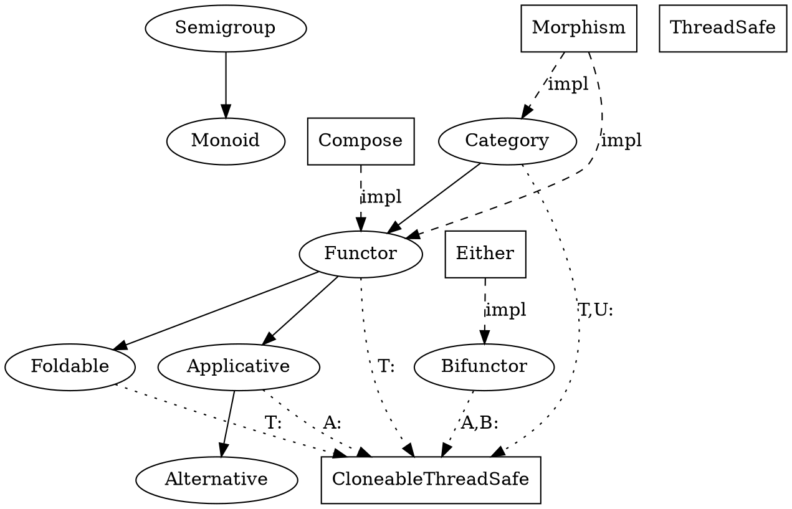

# IMPLEMENTED.md

## Implemented

```graphviz
digraph EffectCoreTraits {
    // Traits
    Semigroup -> Monoid
    Category -> Functor
    Functor -> Applicative
    Applicative -> Alternative
    Functor -> Foldable

    // Types (not inheritance, but usage/implementation)
    ThreadSafe [shape=box]
    CloneableThreadSafe [shape=box]
    Compose [shape=box]
    Either [shape=box]
    Morphism [shape=box]

    // Trait requirements for types (dotted lines)
    Functor -> CloneableThreadSafe [style=dotted, label="T: "]
    Applicative -> CloneableThreadSafe [style=dotted, label="A: "]
    Foldable -> CloneableThreadSafe [style=dotted, label="T: "]
    Category -> CloneableThreadSafe [style=dotted, label="T,U: "]
    Bifunctor -> CloneableThreadSafe [style=dotted, label="A,B: "]

    // Types implement traits (dashed lines)
    Morphism -> Category [style=dashed, label="impl"]
    Morphism -> Functor [style=dashed, label="impl"]
    Compose -> Functor [style=dashed, label="impl"]
    Either -> Bifunctor [style=dashed, label="impl"]
}
```

## TODO

```graphviz
digraph EffectCoreFull {
    // Implemented cluster
    subgraph cluster_implemented {
        label = "Implemented";
        color = blue;
        Semigroup -> Monoid
        Category -> Functor
        Functor -> Applicative
        Applicative -> Alternative
        Functor -> Foldable
        ThreadSafe [shape=box]
        CloneableThreadSafe [shape=box]
        Compose [shape=box]
        Either [shape=box]
        Morphism [shape=box]
        Functor -> CloneableThreadSafe [style=dotted, label="T: "]
        Applicative -> CloneableThreadSafe [style=dotted, label="A: "]
        Foldable -> CloneableThreadSafe [style=dotted, label="T: "]
        Category -> CloneableThreadSafe [style=dotted, label="T,U: "]
        Bifunctor -> CloneableThreadSafe [style=dotted, label="A,B: "]
        Morphism -> Category [style=dashed, label="impl"]
        Morphism -> Functor [style=dashed, label="impl"]
        Compose -> Functor [style=dashed, label="impl"]
        Either -> Bifunctor [style=dashed, label="impl"]
    }
    // _old cluster
    subgraph cluster_old {
        label = "_old";
        color = red;
        arrow
        bufferable
        comonad
        contravariant
        distinctable
        effect
        filterable
        function
        groupable
        interleaveable
        monad
        monad_plus
        natural
        pair
        partitionable
        profunctor
        scannable
        takeable
        throttleable
        traversable
        windowable
        zippable
    }
    // Connections from _old to implemented
    arrow -> Category [label="extends"]
    comonad -> Functor [label="extends"]
    contravariant -> Category [label="relates"]
    effect -> Compose [label="core idea"]
    function -> Morphism [label="related"]
    monad -> Applicative [label="implemented as"]
    monad_plus -> Alternative [label="would combine"]
    monad_plus -> Applicative [label="would combine"]
    natural -> Functor [label="relates"]
    pair -> Bifunctor [label="handled in"]
    pair -> Category [label="handled in"]
    profunctor -> Bifunctor [label="relates"]
    traversable -> Foldable [label="would extend"]
    traversable -> Functor [label="would extend"]
}
```
