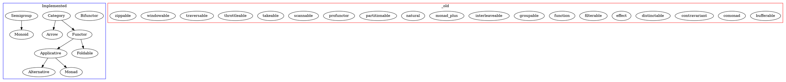

# TODO.md

- [x] Pair
  - [x] Define the core type in `src/types/pair.rs`
    - [x] 🟡 Step 1: Interpret the TODO and the git state
    - [x] 📝 Step 2: Create an Implementation Plan
    - [x] 🔨 Step 3: Implement the Feature or Fix
    - [x] 🧹 Step 6: Self-Review & Clean Up
    - [x] 📚 Step 7: Document the Changes
  - [x] Category - Implement Category for Pair
    - [x] 🟡 Step 1: Interpret the TODO and the git state
    - [x] 📝 Step 2: Create an Implementation Plan
    - [x] 🔨 Step 3: Implement the Feature or Fix
    - [x] ✅ Step 4: Write Exhaustive Tests
    - [x] 🧪 Step 5: Run the Test Suite
    - [x] 🧹 Step 6: Self-Review & Clean Up
    - [x] 📚 Step 7: Document the Changes
  - [x] Arrow - Implement Arrow for Pair
    - [x] 🟡 Step 1: Interpret the TODO and the git state
    - [x] 📝 Step 2: Create an Implementation Plan
    - [x] 🔨 Step 3: Implement the Feature or Fix
    - [x] ✅ Step 4: Write Exhaustive Tests
    - [x] 🧪 Step 5: Run the Test Suite
    - [x] 🧹 Step 6: Self-Review & Clean Up
    - [x] 📚 Step 7: Document the Changes
  - [x] Bifunctor - Implement Bifunctor for Pair
    - [x] 🟡 Step 1: Interpret the TODO and the git state
    - [x] 📝 Step 2: Create an Implementation Plan
    - [x] 🔨 Step 3: Implement the Feature or Fix
    - [x] ✅ Step 4: Write Exhaustive Tests
    - [x] 🧪 Step 5: Run the Test Suite
    - [x] 🧹 Step 6: Self-Review & Clean Up
    - [x] 📚 Step 7: Document the Changes
  - [x] Profunctor - Define the Profunctor trait in `src/traits/profunctor.rs`
    - [x] 🟡 Step 1: Interpret the TODO and the git state
    - [x] 📝 Step 2: Create an Implementation Plan
    - [x] 🔨 Step 3: Implement the Feature or Fix
    - [x] ✅ Step 4: Write Exhaustive Tests
    - [x] 🧪 Step 5: Run the Test Suite
    - [x] 🧹 Step 6: Self-Review & Clean Up
    - [x] 📚 Step 7: Document the Changes
  - [x] Profunctor - Implement Profunctor for Pair
    - [x] 🟡 Step 1: Interpret the TODO and the git state
    - [x] 📝 Step 2: Create an Implementation Plan
    - [x] 🔨 Step 3: Implement the Feature or Fix
    - [x] ✅ Step 4: Write Exhaustive Tests
    - [x] 🧪 Step 5: Run the Test Suite
    - [x] 🧹 Step 6: Self-Review & Clean Up
    - [x] 📚 Step 7: Document the Changes

## Graph

