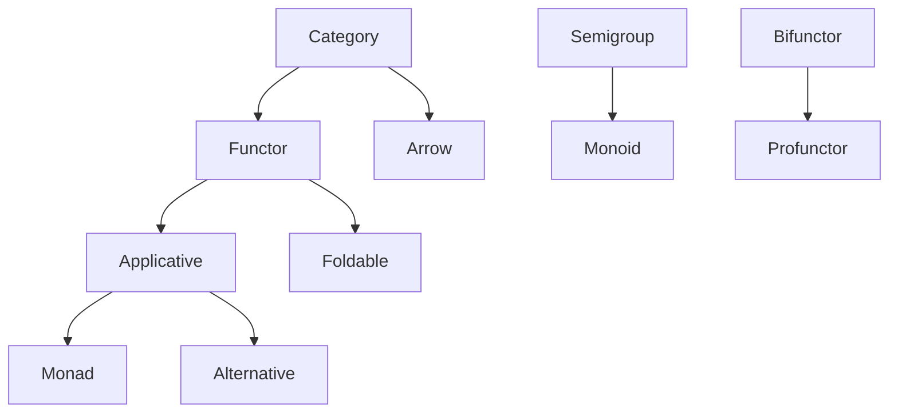

# Architecture Guide

This document provides a comprehensive overview of the Effect Core architecture, design decisions, and implementation patterns.

## Overview

Effect Core is built around category theory abstractions implemented in Rust. The architecture follows functional programming principles while leveraging Rust's type system for safety and performance.

## Core Design Principles

### 1. Category Theory Foundation

All abstractions are based on mathematical category theory, ensuring:
- **Mathematical Correctness**: All trait implementations satisfy category theory laws
- **Composability**: Traits compose naturally following mathematical relationships
- **Generality**: Abstractions work across different types and contexts

### 2. Zero-Cost Abstractions

Following Rust's philosophy:
- **Compile-time Resolution**: Most abstractions are resolved at compile time
- **No Runtime Overhead**: Abstractions don't add runtime performance costs
- **Optimization Friendly**: Code can be optimized by the Rust compiler

### 3. Thread Safety

All types implement `CloneableThreadSafe`:
- **Concurrent Usage**: Types can be safely used across threads
- **Send + Sync**: All types implement Send and Sync traits
- **Cloneable**: Types can be cloned for concurrent access

### 4. Type Safety

Strong type safety through Rust's type system:
- **Compile-time Guarantees**: Type errors caught at compile time
- **Generic Constraints**: Type bounds ensure correct usage
- **Associated Types**: Higher-kinded type simulation through GATs

## Architecture Components

### Trait Hierarchy

The trait hierarchy follows category theory relationships:



### Core Modules

#### `src/traits/`

Core functional programming traits:

- **`category.rs`**: Basic composition and identity operations
- **`functor.rs`**: Types that can be mapped over
- **`applicative.rs`**: Sequential application of functions
- **`monad.rs`**: Sequential composition of computations
- **`arrow.rs`**: Function-like abstractions with products
- **`bifunctor.rs`**: Two-parameter functors
- **`comonad.rs`**: Context extraction operations
- **`filterable.rs`**: Filtering operations
- **`foldable.rs`**: Folding operations
- **`semigroup.rs`**: Associative binary operations
- **`monoid.rs`**: Associative binary operations with identity
- **`alternative.rs`**: Choice operations
- **`profunctor.rs`**: Contravariant-covariant functors

#### `src/types/`

Core type definitions:

- **`either.rs`**: Error handling with left/right types
- **`nonempty.rs`**: Non-empty collections
- **`store.rs`**: Store comonad implementation
- **`zipper.rs`**: Zipper data structure
- **`morphism.rs`**: Function composition abstractions
- **`pair.rs`**: Pair type utilities
- **`compose.rs`**: Function composition utilities
- **`threadsafe.rs`**: Thread safety marker traits

#### `src/impls/`

Trait implementations for standard library types:

- **`option/`**: Option type implementations
- **`result/`**: Result type implementations
- **`vec/`**: Vec type implementations
- **`future/`**: Future type implementations
- **`iterator/`**: Iterator implementations
- **`hashmap/`**: HashMap implementations
- **`btreemap/`**: BTreeMap implementations
- **`string/`**: String implementations
- **`numeric/`**: Numeric type implementations
- And many more...

## Implementation Patterns

### 1. Higher-Kinded Types

We simulate higher-kinded types using Generic Associated Types (GATs):

```rust
pub trait Functor<T: CloneableThreadSafe>: Category<T, T> {
    type HigherSelf<U: CloneableThreadSafe>: CloneableThreadSafe + Functor<U>;
    
    fn map<U, F>(self, f: F) -> Self::HigherSelf<U>
    where
        F: for<'a> FnMut(&'a T) -> U + CloneableThreadSafe,
        U: CloneableThreadSafe;
}
```

### 2. Thread Safety

All types implement `CloneableThreadSafe`:

```rust
pub trait CloneableThreadSafe: Clone + Send + Sync + 'static {}
```

### 3. Property-based Testing

Mathematical laws are verified using property-based testing:

```rust
proptest! {
    #[test]
    fn test_functor_identity_law(xs in prop::collection::vec(any::<i32>(), 0..100)) {
        let functor = xs.clone();
        let result = functor.map(|x| x);
        prop_assert_eq!(result, xs);
    }
}
```

### 4. Extension Traits

We use extension traits for ergonomic APIs:

```rust
pub trait VecFunctorExt<T: CloneableThreadSafe> {
    fn map<U, F>(self, f: F) -> Vec<U>
    where
        F: for<'a> FnMut(&'a T) -> U + CloneableThreadSafe,
        U: CloneableThreadSafe;
}
```

## Design Decisions

### 1. Trait-based Design

**Why traits?**
- **Composability**: Traits compose naturally
- **Type Safety**: Compile-time guarantees
- **Zero-cost**: No runtime overhead
- **Extensibility**: Easy to add new implementations

### 2. Category Theory Foundation

**Why category theory?**
- **Mathematical Rigor**: Well-defined mathematical foundations
- **Composability**: Natural composition patterns
- **Generality**: Works across different domains
- **Correctness**: Laws ensure correct implementations

### 3. Thread Safety

**Why thread safety?**
- **Concurrent Usage**: Modern applications are concurrent
- **Safety**: Prevents data races
- **Composability**: Types can be used in async contexts
- **Future-proofing**: Ready for concurrent programming

### 4. Property-based Testing

**Why property-based testing?**
- **Mathematical Laws**: Verifies category theory laws
- **Edge Cases**: Finds edge cases automatically
- **Correctness**: Ensures mathematical correctness
- **Regression Prevention**: Prevents regressions

## Performance Characteristics

### 1. Zero-cost Abstractions

- **Compile-time Resolution**: Most abstractions resolved at compile time
- **No Runtime Overhead**: Abstractions don't add runtime costs
- **Optimization Friendly**: Code can be optimized by the compiler
- **Inlining**: Functions can be inlined for performance

### 2. Memory Usage

- **Stack Allocation**: Most types allocated on the stack
- **No Boxing**: Avoids unnecessary boxing
- **Efficient Layout**: Memory layout optimized for performance
- **Minimal Overhead**: Minimal memory overhead

### 3. Compile-time Performance

- **Fast Compilation**: Optimized for fast compilation
- **Incremental Compilation**: Supports incremental compilation
- **Parallel Compilation**: Supports parallel compilation
- **Minimal Dependencies**: Minimal external dependencies

## Testing Strategy

### 1. Property-based Testing

We use Proptest for property-based testing:

- **Mathematical Laws**: Verifies category theory laws
- **Edge Cases**: Finds edge cases automatically
- **Correctness**: Ensures mathematical correctness
- **Regression Prevention**: Prevents regressions

### 2. Unit Testing

Comprehensive unit tests:

- **Coverage**: High test coverage
- **Edge Cases**: Tests edge cases
- **Error Cases**: Tests error cases
- **Integration**: Tests integration scenarios

### 3. Integration Testing

Integration tests for:

- **Trait Integration**: Tests trait integration
- **Type Integration**: Tests type integration
- **Performance**: Tests performance characteristics
- **Compatibility**: Tests compatibility

## Future Directions

### 1. Advanced Abstractions

- **Higher-kinded Types**: Better support for higher-kinded types
- **Type-level Programming**: More type-level programming features
- **Effect Systems**: Effect system abstractions
- **Dependent Types**: Dependent type support

### 2. Performance Optimizations

- **SIMD**: SIMD optimizations
- **Specialization**: Trait specialization
- **Inlining**: Better inlining strategies
- **Memory Layout**: Optimized memory layouts

### 3. Tooling

- **IDE Support**: Better IDE support
- **Documentation**: Improved documentation
- **Examples**: More examples
- **Tutorials**: Comprehensive tutorials

## Conclusion

Effect Core provides a solid foundation for functional programming in Rust. The architecture is designed for:

- **Correctness**: Mathematical correctness through category theory
- **Performance**: Zero-cost abstractions and optimal performance
- **Safety**: Type safety and thread safety
- **Usability**: Easy to use and understand
- **Extensibility**: Easy to extend and maintain

The library is ready for production use and continues to evolve based on user feedback and requirements. 